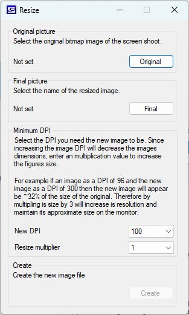

#  ```Resize```

#### Contents
- [Introduction](#Introduction)
- [Instructions](#instructions)
- [Download](#download)
- [Running on macOS, Linux and BSD PCs](#running-on-macos-linux-or-bsd-computers)

## Introduction



```Resize``` is designed to increase the DPI resolution of images so that they meet the minimum resolution that a journal will accept. While it is possible to do this with many graphic programs, this program makes the task very easy. It does not use anti aliasing when expanding the resolution and so does not make the image fuzzy

## Instructions

### Image selection

Resize will process images files with these file extensions: *.bmp, *.png and *.jpg. To select a image press the ```Original``` button and use the File Dialogue box to select the file.

### Exported files name

Press the ```Final``` button, use the file dialogue box to select the folder to save the image to and then enter the name of the resized image file's name.

### Create the file

Select the new DPI from the ```new DPI``` dropdown list and then set the multiplier using the ```Resize multiplier list.  
If the DPI of the original image is 200 and you want a 600 DPI file the multiplier is 3 (600 / 3). If the image is a screen shoot its DPI is likely to be 96. To be certain, right click on the file in Windows File explore and select ***properties***. On the window, select the ***Details*** tab and the images DPI will be displayed in the **Image** section.

Finally, press the ```Create``` button and Resize will create the file. When completed a Dialogue box with the word __Done__ will be displayed.

## Download

The compiled program can be downloaded from [here](program/).

## Running on macOS, Linux or BSD computers

```Resize``` can run on arrange of non-Windows PCs as described [here](Running_Linux_and_macOS/README.md).

